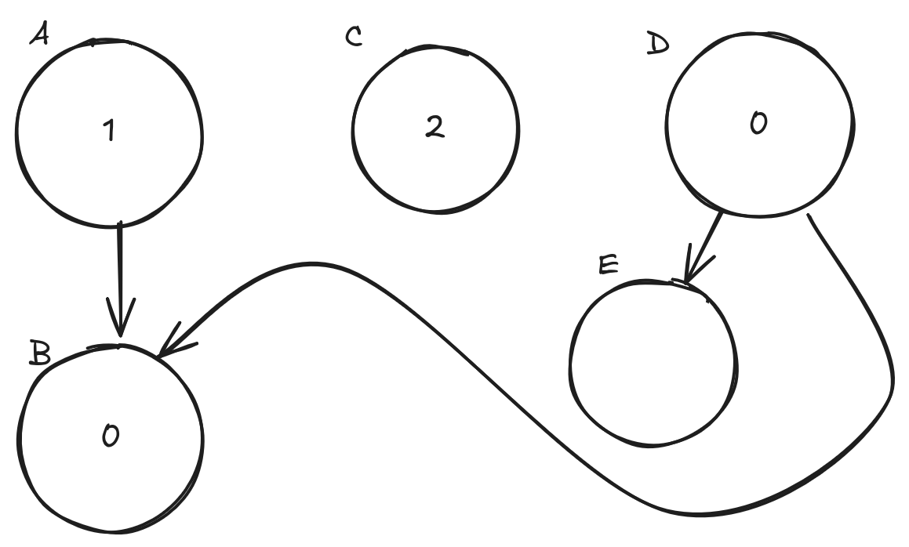

Demo: https://nicolo-ribaudo.github.io/firefox-async-evaluation-bug/

---

Consider this module graph:

Where B and C have top-level await.

And an entrypoint/orchestrator that:
- imports A
- once B starts evaluating, it imports C.
- it resolves the promises that C is waiting on.
- once C is done evaluating, it imports D.
- once E is done evaluating (and thus D is waiting on B), it resolves the promise that B is waiting on.

Once B finishes evaluating, the expected execution order is that A will start evaluating before D, as it was imported first and thus its [[AsyncEvaluationOrder]] internal slot (or, the order in which its [[AsyncEvaluation]] field was set to true, in the older spec) is lower.

Firefox currently evaluates D before A, which is a bug. This is because firefox resets the [[AsyncEvaluation]] counter whenever it completes evaluation of the root of an async graph: it will reset the counter to 0 once C is done evaluating. The numbers in the graph above show the [[AsyncEvaluation]] order that Firefox assigns to each module.
